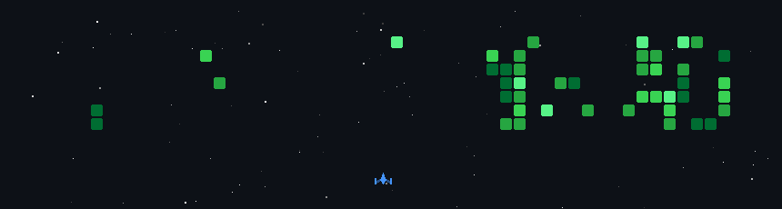

<h1 align="center">Hey, I'm Surya Nandan 👋</h1>

<h3 align="center">
  Web/App Developer • ML Explorer • Game & 3D Enthusiast
</h3>

  I build projects using Web Development, React Native, Python, Machine Learning,
  OpenCV, and creative 3D/game technologies.

  

---

## 🚀 About Me

- 🌱 Currently learning **React, React Native, Machine Learning and OpenCV**
- 🧠 Interested in **AI, Fitness Tech, Travel Tech and Gaming UI**
- 🎮 Exploring **Unity, Blender and 3D experiences**
- 💻 Building real-world projects to improve my skills
- 📫 Reach me at **gvsnandan07@gmail.com**

---

## ⚡ Tech Stack

  
  
  
  
  
  
  
  
  
  
  
  
  
  
  
  
  
  
  

  <b>Also worked with:</b> Firebase, Flask, Tailwind CSS, Figma, Expo, FastAPI, Supabase, Vercel, n8n, YOLO/Ultralytics, REST APIs

---
## 📊 GitHub Stats

  

  

  

---

  

---

## 🌐 Connect With Me

  
  
  

